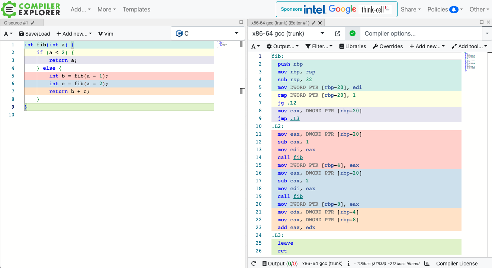

---

marp: true
paginate: true
theme: gaia
class:
  - invert

---

<!-- _class: lead invert -->

# 👷🏗️ Building a "Ruby-like Language" Compiler in Ruby

## RubyでつくるRubyみたいな言語のコンパイラ

Fukuoka RubyistKaigi 04
2024.09.07
@htkymtks

<!--
Rubyで、Rubyみたいな言語のコンパイラを作った話と、その中で得た経験やコツについてお話しします。
-->

---

## ✂️ 自己紹介

* はたけやまたかし
* 株式会社永和システムマネジメント
* X(Twitter)： @htkymtks


<!--
はたけやまたかしと申します。永和システムマネジメントという会社でRubyプログラマとして暮らしています。
Twitter（現X）ではこちらのアカウントで主にダジャレをつぶやいています。
-->

---

## 🐫 趣味の低レイヤ活動

* CPU自作（TD4, RISC-V）
* RISC-Vシミュレータ自作
* MinCamlコンパイラを移植（RISC-V、ARM64）
* コンパイラ作成（TinyRuby） ← NEW!!!

  

<!--
趣味で低レイヤプログラミングをしています。
東大のCPU実験という授業に触発されて、CPUを自作したり、RISC-Vのシミュレータを自作したり、MinCamlというコンパイラをRISC-VやARM64に移植したりしています。

そして、コンパイラの移植を通して、移植ではなく1からコンパイラを作ってみたいという気持ちが高まった結果、TinyRubyというコンパイラを作成しました。

今日はこのTinyRubyのお話しになります。
-->

---

### 🙂 今日話すこと

* TinyRubyの紹介
* コンパイラ作成のTIPS
* コンパイラはじめの一歩

### 🙃 話さないこと

* 字句解析と構文解析
* 最適化
* 型検査

<!--
今日お話しすることは、TinyRubyの紹介と、MinCamlの移植やTinyRubyの作成を通して得たコンパイラ作成のコツについてお話ししつつ、最後に実際にコンパイラを作成する過程をお見せします。

また、字句解析や構文解析、最適化、型検査などについては、今日はお話はしません。
-->

---

<!-- 文字を少し小さく -->
<style scoped> section { font-size: 2.0em; } </style>

# 🐇 TinyRuby の紹介

こんな感じのRubyみたいなプログラミング言語

```ruby
#
# fib.rb
#

def fib(n)
  if n < 2
    n
  else
    fib(n-1) + fib(n-2)
  end
end

# 10番目のフィボナッチ数を計算
p fib(10)
```

<!--
こちらは、フィボナッチ数を計算するTinyRubyのプログラムです。
こんな感じのRubyみたいな言語です。
-->
---

## 🐇🐇 TinyRuby のビルドと実行

こんな感じにビルドする

```sh
# コンパイルしてアセンブリを出力
$ ruby tinyrubyc.rb fib.rb > fib.s

# アセンブリをアセンブルして実行ファイルを作成
$ gcc -o fib fib.s libtinyruby.c

# 実行
$ ./fib
55
```

<!--
TinyRubyのビルド方法はこんな感じです。

まず、TinyRubyコンパイラでプログラムをコンパイルしてアセンブリを出力して、
gcc にアセンブルとリンクをしてもらって実行ファイルを作成します。

この `libtinyruby.c` というのは、TinyRubyの組み込みライブラリで、プリント関数などが定義されています。

最後に、作成した実行ファイルを実行すると、10番目のフィボナッチ数が表示されます。
-->

---

# 🤖 TinyRuby と MinRuby

* TinyRuby は MinRuby のサブセット
  * パーサとして MinRuby のパーサを利用
  * MinRuby のパーサーは RubyGems として提供されている
* MinRuby
  * 書籍「RubyでつくるRuby」に登場するRubyのサブセット
* MinRuby との差異
  * データ型は整数型のみ
  * ArrayとHashをサポートしない
  * 関数の引数は6つまで


<!--
TinyRuby を Ruby みたいな言語と表現しましたが、もう少し具体的に言うと、TinyRuby は MinRuby のサブセットとなる言語で、パーサとして MinRuby のパーサを利用しています。

MinRuby は、書籍「RubyでつくるRuby」に登場する Ruby のサブセット言語で、MinRuby のパーサは RubyGems として提供されています。

TinyRuby と MinRuby の違いは、TinyRuby はデータ型が整数型のみだとか、Array や Hash をサポートしないとか、関数の引数が6つまでだとか、いくつかの制限があります。
-->

<!-- 文字を少し小さく -->
<style scoped> section { font-size: 1.8em; } </style>

---

## 🐧 TinyRubyコンパイラのターゲット環境

* CPU
  * x86-64
* OS
  * Linux

<!--
TinyRuby コンパイラのターゲット環境は x86-64 の Linux です。
私の手元の環境は M1 Mac なので、x86-64 でも Linux でもないので、Docker で仮想環境を作って開発しています。
-->

---

# 🍟 コンパイラ作成のTIPS

1) Cコンパイラが出力するアセンブリコードを活用
2) レジスタとABIを知る
3) インクリメンタルな機能実装

<!--
次に、TinyRuby の作成を通して得たコンパイラ作成のコツを紹介します。

1) Cコンパイラが出力するアセンブリコードの活用
2) レジスタとABIを知る
3) インクリメンタルな機能実装
4) 一冊目にドラゴンブックを買わない
-->

---

# :one: Cコンパイラが出力するアセンブリコードを活用

アセンブリの書き方に悩んだら、Cコンパイラが出力するアセンブリを確認する

* 2つの確認方法
  * (1) GCCの`-S`オプション
  * (2) Compiler Explorer

<!--
ひとつ目のコンパイラ開発のコツは、アセンブリの書き方に悩んだら、Cコンパイラが出力するアセンブリを確認するということです。

Cコンパイラが出力するアセンブリを確認する方法は、以下の2つがおすすめです。
1つめは、gcc の「ハイフンS」オプションを使う方法
2つめは、Compiler Explorer というサイトを使う方法です。
-->

---

## 🐃 GCCの `-S` オプション

GCC の `-S` オプションで、Cからアセンブリを出力できる

```c
// test.c
int return_100() {
  return 100;
}
```

```sh
$ gcc -S -masm=intel test.c
```

<!--
まずは GCC の「ハイフンS」オプションを使う方法です。

例えば、こんな C のプログラムを用意して、gcc の「ハイフンS」オプションを使ってアセンブリを出力すると...（次のページ）
-->

---

## 🐃🐃 GCCの `-S` オプション

出力されたアセンブリコード

```sh
$ gcc -S -masm=intel test.c
$ cat test.s
	.intel_syntax noprefix
	.text
	.globl	return_100
	.type	return_100, @function
return_100:
	push	rbp
	mov	rbp, rsp
	mov	eax, 100
	pop	rbp
	ret
```

<!--
こんな感じにアセンブリコードが出力されます。
-->

---

<!-- はみ出し！！！ -->
<!-- 文字を少し小さく -->
<style scoped> section { font-size: 2.0em; } </style>

## 　⚡️ Compiler Explorer ( https://godbolt.org/ )

様々な言語・コンパイラ・CPUのアセンブリ出力を確認できるサイト



<!--

https://godbolt.org/

もう1つの方法は、Compiler Explorer というサイトを使う方法です。

Compiler Explorer は、様々な言語、コンパイラ、CPUのアセンブリや中間形式の出力を確認できるカッコいいサイトです。

Compiler Explorer の画面は2つの領域に分かれていて、左側にはソースプログラムを書くと、右側にそのソースのアセンブリが出力されます。

ソースプログラムのどの部分が、アセンブリコードのどの部分に対応しているかが、色によってわかりやすく表示されるので、アセンブリの理解に役立ちます。
-->

---

# :two: レジスタとABIを知る

コンパイラが出力するアセンブリを理解するためには、対象となるCPUの「レジスタ構成」と「ABI」を知る必要がある

<!--
ふたつめのコンパイラ開発のコツは、対象となるCPUのレジスタ構成と、ABIを知ることです。
-->

---

<!-- はみ出し！！！ -->
<!-- 文字を少し小さく -->
<style scoped> section { font-size: 1.5em; }</style>

### 📝 汎用レジスタ一覧

x86-64 には、64 ビットの汎用レジスタが 16 本用意されている

<table>
  <thead><th>レジスタ名</th><th>用途</th><th>レジスタ名</th><th>用途</th></thead>
  <tbody>
    <tr><td>RAX</td><td>関数の戻り値など</td><td>R8</td><td>関数の第五引数など</td></tr>
    <tr><td>RBX</td><td></td><td>R9</td><td>関数の第六引数など</td></tr>
    <tr><td>RCX</td><td>関数の第四引数など</td><td>R10</td><td></td></tr>
    <tr><td>RDX</td><td>関数の第三引数など</td><td>R11</td><td></td></tr>
    <tr><td>RSI</td><td>関数の第二引数など</td><td>R12</td><td></td></tr>
    <tr><td>RDI</td><td>関数の第一引数など</td><td>R13</td><td></td></tr>
    <tr><td>RBP</td><td>ベースポインタ</td><td>R14</td><td></td></tr>
    <tr><td>RSP</td><td>スタックポインタ</td><td>R15</td><td></td></tr>
  </tbody>
</table>

<!--

まずはレジスタについてです。CPUには「レジスタ」と呼ばれるデータの記憶領域があり、そのレジスタの構成は CPU ごとに異なります。これが分からないと、アセンブリの読み書きがままならないので、対象 CPU のレジスタの理解は大切です。

例えば、x86-64 では、「RAX から RSP」と「R8 から R15」までの 16 個の汎用レジスタが用意されていて、それぞれにメインの役割があります。

また、これ以外にも浮動小数点数用のレジスタや、フラグレジスタなるものがあったりしますが、ここでは省略します。
-->

---

# 🦐 x86-64 のABI (Application Binary Interface)

アセンブリ言語レベルでの関数の呼び出し規約などのこと

<!--
次に、ABI についてお話しします。

ABI とは、Application Binary Interface の略で、アセンブリ言語レベルでの関数の呼び出しなどの規約のことです。
-->

---

## 🤧 関数の引数の渡し方

* 最初の6つの引数は、RDI, RSI, RDX, RCX, R8, R9 レジスタに渡す
* 7つ目以降の引数は、スタックに積む

## 🐸 関数の戻り値の返し方

* 戻り値は、RAX レジスタに返す

<!--
例えば関数を呼び出す場合、第一引数は RDI レジスタに、第二引数は RSI レジスタに、といったように決められたレジスタに引数の値を渡します。また第七引数以降はスタックに引数の値を積みます。

また、関数の戻り値は RAX レジスタに返す、みたいなことが ABI で決められています。
-->

---

## 🦀 ABI の詳細資料

x86-64 の ABI の詳細については、以下のドキュメントなどを参照

* System V Application Binary Interface AMD64 Supplement
  * https://refspecs.linuxbase.org/elf/x86-64-abi-0.99.pdf

<!--
ABI のより詳細な情報については、こちらの「System V Application Binary Interface AMD64 Supplement」などを参照してください。

また、これは x86-64 で Linux の ABI なので、他の OS、他の CPU の場合は、対象となる環境の ABI を調べる必要があります。
-->

---

<!-- はみ出し！！！ -->
<!-- 文字を少し小さく -->
<style scoped> section { font-size: 1.9em; } </style>

# :three: インクリメンタルな機能実装

* 最初は、入力された整数リテラルを評価するだけのプログラムからスタート
* 1つずつ機能を追加していく
  * 整数リテラル
  * → 四則演算
  * → 変数代入/参照
  * → 複数ステートメント
  * → 比較演算
  * → 条件分岐
  * → 関数呼び出し
  * → 関数定義
  * → ...

<!--
-->

---

<!-- 文字を少し小さく -->
<style scoped> section { font-size: 2.3em; } </style>

## :walking: インクリメンタルな機能実装のメリット

* コンパイラへの理解を徐々に深めることができる
* モチベーションを維持しやすい

* 参考サイト
  * 低レイヤを知りたい人のためのCコンパイラ作成入門 https://www.sigbus.info/compilerbook
  * An Incremental Approach to Compiler Construction http://scheme2006.cs.uchicago.edu/11-ghuloum.pdf

---

<!-- _class: lead invert -->

# :walking: コンパイラはじめの一歩

これまで紹介したTIPSを使って、整数を評価して返すだけの TinyRuby コンパイラを作ってみます

---

<!-- _class: lead invert -->

# 🎬 動画スタート

---

# 🍜 まとめ

* コンパイラ作成のTIPSの紹介
  * Cコンパイラが出力するアセンブリコードの活用
  * レジスタとABIを知る
  * インクリメンタルな機能実装
* コンパイラを通して低レイヤの世界にふれてみよう！
