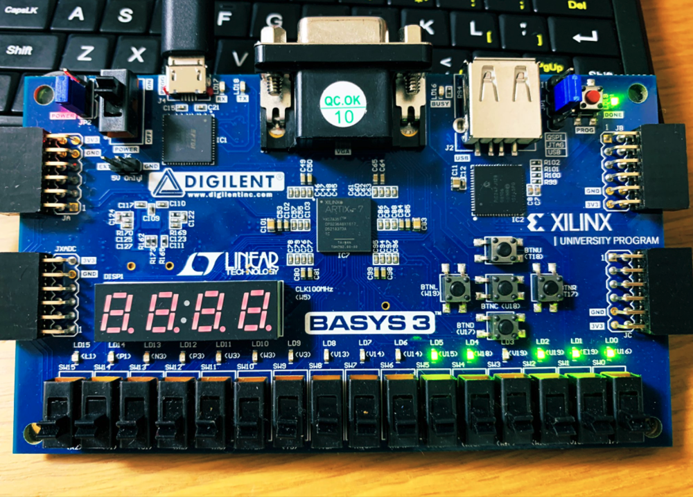

---

marp: true
paginate: true
theme: gaia
class:
  - invert

---

<!-- _class: lead invert -->

# 👷🏗️ Building a "Ruby-like Language" Compiler in Ruby

## RubyでつくるRubyみたいな言語のコンパイラ

Fukuoka RubyistKaigi 04
2024.09.07
@htkymtks

<!--
今日は

Rubyみたいな言語のコンパイラを
Rubyで作ったお話と、

その中で得た「経験」や「コツ」についてお話ししようと思います。
-->

---

## 🐦 自己紹介

- はたけやまたかし
- 株式会社永和システムマネジメント
  
- Twitter(現X)： @htkymtks
  

<!--
まず自己紹介です。

はたけやまたかしと申します。

株式会社永和システムマネジメントという会社で、Rubyプログラマとして働いています。

また、ダジャレが好きなので、思いついたダジャレをTwitterへ放流したりしています。

こちらは「最近のお気に入りツイート」になります。
-->

---

# 🏁 趣味

- 低レイヤプログラミング
  - 自作CPU
  - 自作RISC-Vシミュレータ
  - MinCamlコンパイラの移植

 

<!--
また、趣味で低レイヤプログラミングをしています。

CPUを自作したり、
RISC-Vのシミュレータを作ったり、
MinCamlコンパイラを移植したりしています。
-->

---

# 🐪 MinCaml → 💎TinyRuby

- 趣味のMinCamlコンパイラの移植を行なっているうちに、1からコンパイラを作りたくなる
- そこで TinyRuby ですよ!!!

<!--
趣味の MinCaml コンパイラの移植をしているうちに、1からコンパイラを作りたくなってきまして、そこで 今日お話しする TinyRuby の開発を始めました。
--->

---

### 🙂 今日話すこと

- TinyRubyの紹介
- コンパイラ作成Tips
- コンパイラはじめの一歩

<!--
今日お話しすることは、

TinyRubyの紹介と、

TinyRubyの作成を通じて得た「コンパイラ作成の便利情報、Tips」について、

そして、「コンパイラの初めの一歩」ということで、実際にコンパイラを作成する流れをお見せしたいと思います。
-->

---

<style scoped> section { font-size: 2.0em; } </style>

# 🐇 TinyRuby の紹介

こんな感じのRubyみたいなプログラミング言語

```ruby
#
# sample.rb
#

def fib(n)
  if n < 2
    n
  else
    fib(n-1) + fib(n-2)
  end
end

# 10番目のフィボナッチ数を計算
p fib(10)
```

<!--
では TinyRuby についてご紹介します。TinyRubyは、こんな感じのRubyみたいなプログラミング言語になります。
-->

---

## 🐇🐇 TinyRuby のビルドと実行

こんな感じにビルドする

```sh
# コンパイルしてアセンブリを出力
$ ruby tinyrubyc.rb sample.rb > sample.s

# アセンブリをアセンブルして実行ファイルを作成
$ gcc sample.s libtinyruby.c

# 実行
$ ./a.out
55
```

<!--
さきほど書いたサンプルプログラムのビルド手順はこんな感じです。

まず、TinyRubyコンパイラで sample.rb をコンパイルすると、コンパイル結果のアセンブリが標準出力に出力されます。これを sample.s というファイルに保存します。

次に、先ほど生成したアセンブリファイル sample.s を、gcc コマンドでアセンブルとリンクを行い、実行ファイル a.out を生成します。

実行ファイル a.out を実行すると、プログラムの実行結果が画面に出力されます。
-->

---

<style scoped> section { font-size: 1.9em; } </style>

# 🤖 TinyRuby のパーサー

- TinyRubyのパーサーはMinRubyのパーサーをそのまま利用
- MinRuby
  - 書籍「RubyでつくるRuby」に登場するRubyのサブセット
- MinRuby との差異
  - データ型は整数型のみ
  - ArrayとHashをサポートしない
  - 関数の引数は6つまで
- TinyRubyはMinRubyのサブセット


<!--
次はTinyRubyの構文解析器、パーサーについてです。

TinyRubyのパーサーはMinRubyのパーサーをそのまま利用しています。

MinRubyというのは、「RubyでつくるRuby」という書籍に登場する、Rubyのサブセット言語です。こちらの書影が「RubyでつくるRuby」になります。

TinyRubyはMinRubyのパーサーを使ってはいますが、コンパイラの実装を簡単にするため、MinRubyからいくつかの機能が落とされています。

例えば、
「データ型は整数型のみ」だったり、
「ArrayとHashをサポートしない」だったり、
「関数の引数は6つまで」などの制限があります。

そのため、TinyRubyはMinRubyのサブセット言語と言えます。
-->

---

## 🐧 TinyRubyコンパイラのターゲット環境

- CPU
  - x86-64
- OS
  - Linux
- 開発環境
  - MacやWindowsの人はDocker上のLinux環境などで開発してね
<!--
TinyRubyコンパイラのターゲット環境は、CPUが x86-64 で、OSが Linux となります。

macOS や Windows をお使いの方は、Docker 上の Linux 環境などで開発できます。
私も M1 Mac を使っているので、Docker 上で開発を行いました。
-->

---

# 🦊 コンパイラ作成のTips

1) Cコンパイラが出力するアセンブリコードを活用
2) レジスタとABIを知る
3) 小さなステップで進める


<!--
次は、TinyRuby の作成を通して学んだ、コンパイラ作成時に使える便利情報、Tipsを紹介します。

1) Cコンパイラが出力するアセンブリコードの活用
2) レジスタとABIを知る
3) 小さなステップで進める
-->

---

# :one: Cコンパイラが出力するアセンブリコードを活用

アセンブリの書き方に悩んだら、Cコンパイラが出力するアセンブリを確認する

- 2つの確認方法
  - (1) Compiler Explorer
  - (2) GCCの`-S`オプション

<!--
では、1つ目のTips「Cコンパイラが出力するアセンブリコードを活用する」についてお話しします。

アセンブリを書いていると、「C言語ではどう書くかはわかるけど、アセンブリでどう書けばいいか分からない！」ということがよくあります。

そんな時は、希望する処理を行うプログラムをCで書き、Cコンパイラにアセンブリコードを出力させることで、アセンブリコードを確認できます。

Cコンパイラにアセンブリコードを出力させる方法はいくつかありますが、「Compiler Explorerを使う方法」と「GCCの `-S` オプションを使う方法」の2つがお手軽で便利です。
-->

---

<style scoped> section { font-size: 2.0em; } </style>

## 　⚡️ Compiler Explorer ( https://godbolt.org/ )

様々な言語・様々なCPUのアセンブリ出力を確認できる神サイト
<video src="godbolt.mov"   width="800" controls></video>

<!--
https://godbolt.org/

まずは Compiler Explorer を使う方法を紹介します。

Compiler Explorer は、様々な言語、様々なCPUが出力するアセンブリを確認できるカッコいいサイトです。

（動画を再生）

・Compiler Explorer の画面は2つの領域に分かれていて、左側にはソースプログラムを書くと、右側にそのソースのアセンブリが出力されます。

・Cのソースプログラムのどの部分が、アセンブリコードのどの部分に対応しているかが、色によってわかりやすく表示されるので、アセンブリの理解に役立ちます。
-->

---

## 🐃 GCCの `-S` オプション

GCC の `-S` オプションで、Cからアセンブリを出力できる

```c
// test.c
int return_100() {
  return 100;
}
```

```sh
$ gcc -S -masm=intel test.c
```

<!--
次に、GCCの「-S」オプションを使う方法を紹介します。

通常、GCCにC言語のソースコードを渡すと、実行ファイルやオブジェクトファイルが生成されます。

しかし、gcc に「-S」オプションを付けることで、コンパイルのみを行い、その結果をアセンブリファイルとして出力することができます。

例えば、次のようなC言語のソースコードを「-S」オプションをつけて実行すると...（次のページ）
-->

---

## 🐃🐃 GCCの `-S` オプション

出力されたアセンブリコード

```sh
$ gcc -S -masm=intel test.c
$ cat test.s
	.intel_syntax noprefix
	.text
	.globl	return_100
	.type	return_100, @function
return_100:
	push	rbp
	mov	rbp, rsp
	mov	eax, 100
	pop	rbp
	ret
```

<!--
このようなアセンブリコードが出力されます。
-->

---

## ⚡️🐃 Compiler Explorer と GCC の使い分け

Compiler Explorer が出力したアセンブリは、出力オプションやプラットフォームの違いで、そのままでは動かないことがある

- 出力したアセンブリをそのままビルドにかけたい場合
  - → GCC
- それ以外
  - → Compiler Explorer

<!--
「Compiler Explorer」と「GCC」の使い分けについてです。

基本的には「Compiler Explorer」を使っておけばOKですが、

Compiler Explorer が出力するアセンブリは、出力オプションに

Compiler Explorer が出力したアセンブリは、出力オプションの設定によっては、そのままビルドできないことがままあります。

そのため、出力したアセンブリをそのままビルドにかけたい場合などは「GCC」で。

そうでない場合は「Compiler Explorer」を使うと良いでしょう。
-->

---

# :two: レジスタとABIを知る

コンパイラが出力するアセンブリを理解するためには、対象となるCPUの「レジスタ構成」と「ABI」を知る必要がある

<!--
二つめのTipsは「レジスタとABIを知る」です。

コンパイラが出力するアセンブリを理解するためには、対象となるCPUの「レジスタ構成」と「ABI」を知る必要があります。
-->

---

<style scoped> section { font-size: 1.5em; }</style>

### 📝 汎用レジスタ一覧

x86-64 の 16 本の 64 ビット汎用レジスタ

<table>
  <thead><th>レジスタ名</th><th>用途</th><th>レジスタ名</th><th>用途</th></thead>
  <tbody>
    <tr><td>RAX</td><td>関数の戻り値など</td><td>R8</td><td>関数の第五引数など</td></tr>
    <tr><td>RBX</td><td></td><td>R9</td><td>関数の第六引数など</td></tr>
    <tr><td>RCX</td><td>関数の第四引数など</td><td>R10</td><td>一時データ置き場</td></tr>
    <tr><td>RDX</td><td>関数の第三引数など</td><td>R11</td><td>一時データ置き場</td></tr>
    <tr><td>RSI</td><td>関数の第二引数など</td><td>R12</td><td></td></tr>
    <tr><td>RDI</td><td>関数の第一引数など</td><td>R13</td><td></td></tr>
    <tr><td>RBP</td><td>ベースポインタ</td><td>R14</td><td></td></tr>
    <tr><td>RSP</td><td>スタックポインタ</td><td>R15</td><td></td></tr>
  </tbody>
</table>

<!--
まずレジスタについて説明します。

CPUには「レジスタ」と呼ばれるデータの記憶領域があり、CPUが演算を行う際に利用したり、一時的なデータの置き場として利用したりします。

x86-64 は、ここに示す 16 本の 64 ビット汎用レジスタがあります。

また、これ以外にも浮動小数点数用のレジスタや、フラグレジスタなるものがあったりしますが、ここでは省略します。
-->

---

# 🦐 x86-64 のABI (Application Binary Interface)

アセンブリ言語レベルでの関数の呼び出し規約などのこと

<!--
次に、ABI についてお話しします。

ABI とは、Application Binary Interface の略で、アセンブリ言語レベルでの関数の呼び出しなどの規約のことです。
-->

---

## 🤧 (x86-64 での) 関数の引数の渡し方

- 最初の6つの引数は、RDI, RSI, RDX, RCX, R8, R9 レジスタに渡す
- 7つ目以降の引数は、スタックに積む

## 🐸 (x86-64 での) 関数の戻り値の返し方

- 戻り値は、RAX レジスタに返す

<!--
例えば、x86-64 で関数を呼び出す際には、

第一引数は RDI レジスタ、
第二引数は RSI レジスタ、
といったように、「第一引数」から「第六引数」までの値を、決められたレジスタにセットする必要があります。
また、第七引数以降はスタックに引数の値を積む必要があります。

これらが ABI によって定められています。

関数の戻り値の返し方も ABI で決められていて、戻り値は RAX レジスタに渡して返す必要があります。

ABI でこうした規約を定義することで、規約に従ったモジュール間での相互呼び出しや、データの連携ができるようになります。
-->

---

## 🦀 ABI の詳細資料

x86-64 の ABI の詳細については、以下のドキュメントなどを参照

- System V Application Binary Interface AMD64 Supplement
  - https://refspecs.linuxbase.org/elf/x86-64-abi-0.99.pdf

<!--
x86-64 の ABI のより詳細な情報については、こちらの資料などを参照してください。

また、これは x86-64 上で動作する Linux の ABI なので、他の OS、他の CPU の場合は、対象となる環境の ABI を調べる必要があります。
-->

---

<style scoped> section { font-size: 1.9em; } </style>

# :three: 小さなステップで進める

小さなステップで機能を追加していく

- 整数リテラル
- 四則演算
- プリント関数呼び出し
- 複数ステートメント
- 変数の代入と参照
- 比較演算
- 条件分岐
- 関数呼び出し
- 関数定義

<!--
3つ目のTipsは「小さなステップで進める」です。

コンパイラを作成する際に、一度に全ての機能を実装するのではなく、小さなステップを刻みながら機能を実装していくと、コンパイラの実装がしやすく、挫折もしにくくなります。

TinyRuby の開発では、
整数リテラルの評価からスタートして、
四則演算、プリント関数呼び出し、複数ステートメント、変数の代入と参照、比較演算、条件分岐、関数呼び出し、関数定義、の順番で機能を追加していきました。
-->

---

<style scoped> section { font-size: 1.9em; } </style>

## 🚦テスト駆動開発 (TDD)

シェルスクリプトでテストを書いて、1機能ずつ実装していく

```test.sh
# 整数リテラル
assert 4649 'p 4649'

# 四則演算
assert 20 'p 10 + 20 - 30 * 4 / 12'
assert 60 'p 10 + 20 + 30'
assert 40 'p 30 + 20 - 10'
assert 200 'p 10 * 20'
assert 33 'p 99 / 3'

# 複文
assert 4649 '1 + 1; p 4649'

# 変数
assert 10 'a = 10; p a'
assert 30 'a = 10; b = 20; p a + b'
```

<!--
また、機能を追加する際に、シェルスクリプトでテストを書いてから機能を1つずつ実装していく「テスト駆動開発」で開発を行いました。

まずは整数リテラルのテストを書いて、コンパイラを実装、
次に四則演算のテストを書いて、コンパイラを実装、
その次に複数ステートメントのテストを書いて、コンパイラを実装、

というようなサイクルを、すべての機能の実装が終わるまで繰り返します。
-->

---

## 🐾 小さなステップで進めることのメリット

- コンパイラに必要な知識を段階的に習得できる
- 適度な粒度でテストを書きやすい → テスト駆動開発が行いやすい

<!--
また、小さなステップで進めることのメリットは、

- コンパイラに必要な知識を段階的に習得できる
- 適度な粒度でテストを書きやすいため、テスト駆動開発が行いやすい

というのがメリットになります。
-->

---

## 🚗 テスト駆動開発(TDD)のメリット

- 目の前の問題にだけ集中できる
- テスト実施が容易
- フィードバックを即時に得られる
- 短いサイクルで達成感を得られるため、モチベーションを維持しやすい

<!--
テスト駆動開発で進めることのメリットは、

- 目の前の問題にだけ集中できる
- テスト実施が容易
- フィードバックを即時に得られる
- 短いサイクルで達成感を得られるため、モチベーションを維持しやすい

などがあります。
-->

---

### 📖 参考資料

- 低レイヤを知りたい人のためのCコンパイラ作成入門
  - https://www.sigbus.info/compilerbook
- An Incremental Approach to Compiler Construction
  - http://scheme2006.cs.uchicago.edu/11-ghuloum.pdf

<!--
「小さなステップでコンパイラ開発を進める方法」や「テスト駆動でのコンパイル開発」については、この2つの参考資料が元になっています。ぜひ、こちらも読んでみてください。
-->

---

<!-- _class: lead invert -->

# :rocket: コンパイラはじめの一歩

これまで紹介したTipsを使って、整数を評価してリターンコードとして返すだけのコンパイラを作成します

<video src="TinyRubyDemo2.mov"   width="800" controls></video>

---

<!-- _class: lead invert -->

## 🦖 続きはこちら

https://scrapbox.io/htkymtks/TinyRubyコンパイラ


<!--
コンパイラの作成手順についての説明は今日はここまでですが、

より詳細な情報が Cosense にまとめられていますので、気になる方はこちらをご覧ください。
-->

---

# 🍜 まとめ

- TinyRuby の紹介
- コンパイラ作成のTipsの紹介
  - Cコンパイラが出力するアセンブリコードの活用
  - レジスタとABIを知る
  - 小さなステップで進める
- コンパイラ作ってみたくなった？
  - コンパイラを通して低レイヤの世界にふれてみよう！

<!--
では、本日のまとめです。

TinyRubyの紹介と、
コンパイラ作成のTipsを紹介しました。

今回の発表で、コンパイラ作ってみたい！と思っていただけたら嬉しいです。
ぜひ、コンパイラを通して低レイヤの世界に触れてみてください。
-->

---

<!-- _class: lead invert -->

# 💎 Let's Enjoy Writing Compilers!
