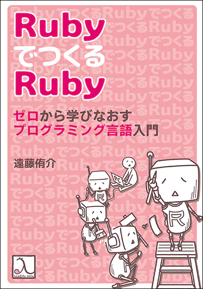
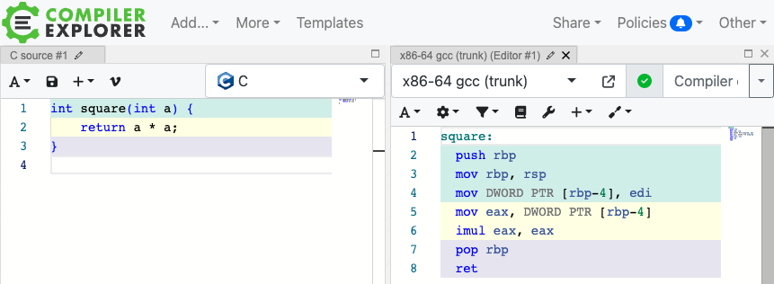

---

marp: true
paginate: true
theme: gaia
class:
  - invert

---

<!-- _class: lead invert -->

# 👷🏗️ Building a "Ruby-like Language" Compiler in Ruby

## RubyでつくるRubyみたいな言語のコンパイラ

Fukuoka RubyistKaigi 04
2024.09.07
@htkymtks

<!--
Rubyで、Rubyみたいな言語のコンパイラを作った話と、その中で得た経験やコツについてお話しします。
-->

---

## ✂️ 自己紹介

* はたけやまたかし
* X(Twitter)： @htkymtks
* 株式会社永和システムマネジメント


<!--
はたけやまたかしと申します。永和システムマネジメントという会社でRubyプログラマとして暮らしています。
Twitter（現X）ではこちらのアカウントで主にダジャレをつぶやいています。
-->

---

## 🐫 趣味の低レイヤ活動

* CPU自作（TD4, RISC-V）
* RISC-Vシミュレータ自作
* MinCamlコンパイラを移植（RISC-V、ARM64）
* コンパイラ作成（TinyRuby） ← NEW!!!

  

<!--
趣味で低レイヤプログラミングをしています。
東大のCPU実験という授業に触発されて、CPUを自作したり、RISC-Vのシミュレータを自作したり、MinCamlというコンパイラをRISC-VやARM64に移植したりしています。

そして、コンパイラの移植を通して、移植ではなく1からコンパイラを作ってみたいという気持ちが高まった結果、TinyRubyというコンパイラを作成しました。

今日はこのTinyRubyのお話しになります。
-->

---

### 🙂 今日話すこと

* TinyRubyの紹介
* コンパイラ作成のTIPS
* コンパイラはじめの一歩

### 🙃 話さないこと

* 字句解析と構文解析
* 最適化
* 型検査

<!--
今日お話しすることは、TinyRubyの紹介と、MinCamlの移植やTinyRubyの作成を通して得たコンパイラ作成のコツについてお話ししつつ、最後に実際にコンパイラを作成する過程をお見せします。

また、字句解析や構文解析、最適化、型検査などについては、今日はお話はしません。
-->

---

<!-- 文字を少し小さく -->
<style scoped> section { font-size: 2.0em; } </style>

# 🐇 TinyRuby の紹介

こんな感じのプログラミング言語

```ruby
#
# fib.rb
#

def fib(n)
  if n < 2
    n
  else
    fib(n-1) + fib(n-2)
  end
end

# 10番目のフィボナッチ数を計算
p fib(10)
```

<!--
こちらは、フィボナッチ数を計算するTinyRubyのプログラムです。
こんな感じのRubyみたいな言語です。
-->
---

## 🐇🐇 TinyRuby のビルドと実行

こんな感じにビルドする

```sh
# コンパイルしてアセンブリを出力
$ ruby tinyrubyc.rb fib.rb > fib.s

# アセンブリをアセンブルして実行ファイルを作成
$ gcc -o fib fib.s libtinyruby.c

# 実行
$ ./fib
55
```

<!--
TinyRubyのビルド方法はこんな感じです。

まず、TinyRubyコンパイラでプログラムをコンパイルしてアセンブリを出力して、
gcc にアセンブルとリンクをしてもらって実行ファイルを作成します。

この `libtinyruby.c` というのは、TinyRubyの組み込みライブラリで、プリント関数などが定義されています。

最後に、作成した実行ファイルを実行すると、10番目のフィボナッチ数が表示されます。
-->

---

<!-- 文字を少し小さく -->
<style scoped> section { font-size: 1.8em; } </style>

# 🤖 TinyRuby と MinRuby

* TinyRuby は MinRubyのサブセット
  * パーサーも MinRuby のものを利用
* MinRuby
  * 「RubyでつくるRuby」に登場するRubyのサブセット
  * MinRuby のパーサーは `minruby` ジェムとして提供されている
* MinRuby との差異
  * データ型は整数型のみ
  * ArrayとHashをサポートしない
  * 関数の引数は6つまで



---

## 🐧 TinyRubyコンパイラのターゲット環境

* CPU
  * x86-64
* OS
  * Linux

---

# 🍟 コンパイラ作成のTIPS

TinyRuby の作成を通して得たコンパイラ作成のコツを紹介

1) 困ったらCコンパイラに聞く
2) レジスタとABIを知る
3) インクリメンタルな機能実装

---

# :one: 困ったらCコンパイラに聞く

* アセンブリの書き方に悩んだら、Cコンパイラが出力するアセンブリを確認する
* 2つの確認方法
  1) GCCの`-S`オプション
  2) Compiler Explorer

---

## 🐃 GCCの `-S` オプション

GCC の `-S` オプションで、Cからアセンブリを出力できる

```c
// test.c
int return_100() {
  return 100;
}
```

```sh
$ gcc -S -masm=intel test.c
```

---

## 🐃🐃 GCCの `-S` オプション

出力されたアセンブリコード

```sh
$ gcc -S -masm=intel test.c
$ cat test.s
	.intel_syntax noprefix
	.text
	.globl	return_100
	.type	return_100, @function
return_100:
	push	rbp
	mov	rbp, rsp
	mov	eax, 100
	pop	rbp
	ret
```

---

<!-- はみ出し！！！ -->
<!-- 文字を少し小さく -->
<style scoped> section { font-size: 2.0em; } </style>

## 　⚡️ Compiler Explorer ( https://godbolt.org/ )

様々な言語・コンパイラ・CPUのアセンブリ出力を確認できるカッコいいサイト（ドメインもカッコいい）

* C, C++, C#, Go, Rust, Swift, WASM, x86, ARM, RISC-V, MIPS, PowerPC, ...



---

# :two: レジスタとABIを知る

コンパイラが出力するアセンブリを理解するためには、対象となるCPUの「レジスタ構成」と「ABI」を知る必要がある

---

<!-- はみ出し！！！ -->
<!-- 文字を少し小さく -->
<style scoped> section { font-size: 2.0em; } </style>

## 📝 x86-64 の64ビット汎用レジスタ

x86-64 には、64 ビットの汎用レジスタが 16 本用意されている

* RAX
* RBX
* RCX
* RDX
* RSI
* RDI
* RBP
* RSP
* R8 〜 R15 (x86-64 で追加された8本のレジスタ)

---

<!-- 文字を少し小さく -->
<style scoped> section { font-size: 2.3em; } </style>

## 📝 x86-64 レジスタとビット幅

x86-64では、64ビットレジスタの下位ビットを、32ビットレジスタや16ビットレジスタとして利用できる

* RAXレジスタ（64ビットレジスタ）
* RAXレジスタの下位32ビット → EAXレジスタ（32ビットレジスタ）
* RAXレジスタの下位16ビット → AXレジスタ（16ビットレジスタ）

---

# 🦐 x86-64 のABI (Application Binary Interface)

アセンブリ言語レベルでの関数の呼び出し規約などのこと

* 関数の引数の渡し方
* 関数の戻り値の返し方
* レジスタの使い方のルール

---

<!-- はみ出し！！！ -->
<!-- 文字を少し小さく -->
<style scoped> section { font-size: 2.0em; } </style>

#### 🤧 関数の引数の渡し方

* 最初の6つの引数は、RDI, RSI, RDX, RCX, R8, R9 レジスタに渡す
* 7つ目以降の引数は、スタックに積む

#### 🐸 関数の戻り値の返し方

* 戻り値は、RAX レジスタに返す

#### 📝 レジスタの使い方のルール

* RBX, RSP, RBP, R12, R13, R14, R15 レジスタを利用する際は、元の値を退避してから利用して、使い終わったら元の値に戻す
* 他の汎用レジスタは、保存などせず勝手に上書きして良い

---

## 🦀 ABI の詳細資料

x86-64 の ABI の詳細については、以下のドキュメントなどを参照

* System V Application Binary Interface AMD64 Supplement
  * https://refspecs.linuxbase.org/elf/x86-64-abi-0.99.pdf
* こちらは Linux で採用されている ABI で、Windows などでは異なる ABI が採用されている

---

<!-- はみ出し！！！ -->
<!-- 文字を少し小さく -->
<style scoped> section { font-size: 1.9em; } </style>

# :three: インクリメンタルな機能実装

* 最初は、入力された整数リテラルを評価するだけのプログラムからスタート
* 1つずつ機能を追加していく
  * 整数リテラル
  * → 四則演算
  * → 変数代入/参照
  * → 複数ステートメント
  * → 比較演算
  * → 条件分岐
  * → 関数呼び出し
  * → 関数定義
  * → ...

---

<!-- 文字を少し小さく -->
<style scoped> section { font-size: 2.3em; } </style>

## 🎲 インクリメンタルな機能実装のメリット

* コンパイラへの理解を徐々に深めることができる
* モチベーションを維持しやすい

#### 参考サイト

* 低レイヤを知りたい人のためのCコンパイラ作成入門 https://www.sigbus.info/compilerbook
* An Incremental Approach to Compiler Construction http://scheme2006.cs.uchicago.edu/11-ghuloum.pdf

---

<!-- _class: lead invert -->

# :walking: コンパイラはじめの一歩

これまで紹介したTIPSを使って、整数を評価して返すだけの TinyRuby コンパイラを作ってみます

---

<!-- _class: lead invert -->

# 🎬 動画スタート

---

# 🍜 まとめ

* コンパイラ作成のTIPSの紹介
  * 困ったらCコンパイラに聞く
  * レジスタとABIを知る
  * インクリメンタルな機能実装
* コンパイラを通して低レイヤの世界にふれてみよう！
